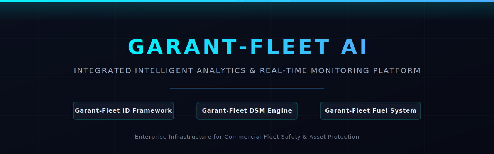

# Garant-Fleet ID: Biometric Authentication & Relay Intervention Framework
### Part of the "Garant-Fleet AI" Integrated Intelligent Analytics Ecosystem



## Platform Overview
**Garant-Fleet ID** is an enterprise-grade biometric authentication and hardware-level ignition control framework engineered for commercial vehicle telematics and Driver Status Monitoring (DSM) platforms. Developed as a core pillar of the **Garant-Fleet AI** ecosystem by a single founder, this real-time detection system prevents unauthorized fleet operation by executing high-speed, local biometric verification prior to vehicle ignition clearance.

---

## Technical Positioning & AI Pipeline
Unlike standard consumer face-recognition scripts, Garant-Fleet ID uses a low-latency, privacy-preserving **Edge AI Engine**. The platform isolates biometric processing locally to ensure offline detection capability and eliminate cellular bandwidth costs.

### Neural Network Data Pipeline
```mermaid
graph LR
    A[Raw IR Video Stream] --> B[MTCNN Face Detection Node]
    B --> C[Facial Landmark Alignment]
    C --> D[Deep Residual Network / CNN]
    D --> E[128-D Facial Vector Extraction]
    E --> F[Local Encrypted DB Matcher]
    F --> G{Authorized Driver?}
    G -->|Yes| H[Relay Intervention: UNLOCK Starter]
    G -->|No| I[Generate IoT Alarm Payload & Fleet Sync]
